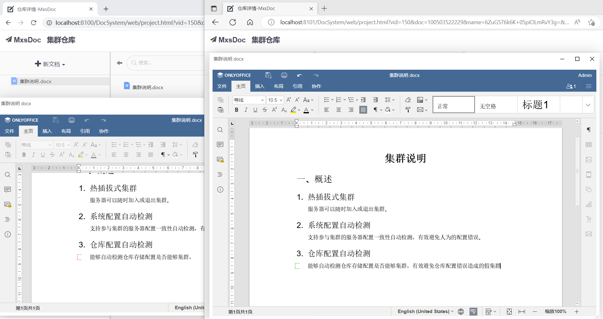

# MxsDoc

[中文 ](README.md) | [English](README_EN.md)

### Introduction
MxsDoc is a web based document storage and management system.


### Features
- Permission Management
- History Management
- Office Edit and Preview
- WPS Edit and Preview
- ZIP/RAR/7z/tar/tgz Preview and Download
- Sharing Management
- Remote Storage: FTP/SFTP/SMB/GIT/SVN/MXSDOC
- Smart Search
- Document Note with markdown format
- Backup on Local Disk
- Backup on Remote Server: FTP/SFTP/SMB/GIT/SVN/MXSDOC
- System Migration
- Recycle Bin
- LDAP based Login 
- Cluster Deployment.

### Usage 

- File Storage System
- Document Storage and Management System
- Distributed File Server
- E-Book System
- Software API Document Management System
- Auto-Backup Tools
- Web-Based SVN Repository
- Web-Based GIT Repository
- Front-End of FTP/SFTP/SMB Server
- Remote Log Management System


### [OneKey Installation](https://github.com/RainyGao-GitHub/DocSys/releases)
One key click to install and start without any dependencies

### [Try It Immediately](http://dw.gofreeteam.com) 
 **Account/Password:**  guest/guest


### Supported Platform: Linux, Windows, Mac.


### Open Source: GPL 2.0


### Customizable Storage Solution
Support to define repository's dedicated rules for storage, history, permission, text-search and encryption. 


### Safe To Store
Documents was stored on local disk, so that there is no impact from system incident crash.


### History
History data was stored in SVN/GIT Repository, You can access the SVN/GIT Repository with your local tools.


### Online Edit
Online Edit was supported for Text/Office/WPS Files without any dependency (No requirement on third party Office software)


### Sharing Management
Support to share file or folder with permission and password control. 


### Smart Search
Support to search File or Folder with name, note or content.


### Management Platform
Support to manage User, Group, Repository, Support to customize System Configuration.


### Cluster Deployment
Support to online join and exit cluster with automatic parameters check (No need to do it manually)


# Install and Upgrade MxsDoc
### 1. Install
#### 1.1 Download Installation Package
CHINA : [Wechat Cloud](https://share.weiyun.com/0Kjpf2o0)

GLOBAL : [GitHub](https://github.com/RainyGao-GitHub/DocSys/releases)

#### 1.2 Install
1.1.1 UnZip Installation package to local disk

1.1.2 Run start script to install

 **Attention:**  Local path should have not space and Chinese characters

#### 1.3 Access MxsDoc
Local Access : http://localhost:8100/DocSystem

Remote Access : Replace "localhost" with server IP

### 2. Upgrade
#### 2.1 Download Upgrade Package [DocSystem.war]
CHINA : [Wechat Cloud](https://share.weiyun.com/0Kjpf2o0)

GLOBAL : [GitHub](https://github.com/RainyGao-GitHub/DocSys/releases)

#### 2.2 Upgrade
Management Platform --> System Management --> System Configuration --> System Upgrade

### 3. Manual Upgrade

#### 3.1 Download Installation Package
For Linux [docsys-linux-x.xx.xx.tar.gz]

For Windows [docsys-win-x.xx.xx.zip]

CHINA : [Wechat Cloud](http://dw.gofreeteam.com/DocSystem/web/project.html?vid=46&shareId=884281120)

GLOBAL : [GitHub](https://github.com/RainyGao-GitHub/DocSys/releases)

#### 3.2 Upgrade
3.2.1 UnZip Installation package to local disk
3.2.2 Upgrade DocSystem
    
  Replace the folder [docsys/tomcat/webapps/DocSystem]

3.2.3 Upgrade MxsDoc Control Scripts

Replcase all bat/sh/vbs files under folder [docsys]  

#### 3.3 Use Cases
For MxsDoc whose version is less than V2.02.51

# Limitation and Price
### Limitation
|Functionalities |  Personal Edition | Professional Edition | Enterprise Edition  | Development Edition  |
| -------------  |  -------------   | ------------- | -------------  | -------------   |
| Price          | [Free](http://dw.gofreeteam.com/DocSystem/web/sales/select.html)  | [Buy](http://dw.gofreeteam.com/DocSystem/web/sales/select.html) | [Buy](http://dw.gofreeteam.com/DocSystem/web/sales/select.html) |  Consult |
| Storage Management     | +         |       +       |     +         |     +         |
| Permission Management     | +         |       +       |     +         |     +         |
| User Management     | +         |       +       |     +         |     +         |
| History     | +         |       +       |     +         |     +         |
| Document's Note     | +         |       +       |     +         |     +         |
| Smart Search     | +         |       +       |     +         |     +         |
| Sharing Management     | +         |       +       |     +         |     +         |
| ZIP/RAR/7z/tar/tgz File Preview     | +         |       +       |     +         |     +         |
| Text File Preview    | +         |       +       |     +         |     +         |
| Text File Edit     | +         |       +       |     +         |     +         |
| Push to Repository   | +         |       +       |     +         |     +         |
| Push to FTP/SFTP/SMB/MXSDOC  | +         |       +       |     +         |     +         |
| Office File Preview  | +         |       +       |     +         |     +         |
| Office File Edit | +         |       +       |     +         |     +         |
| WPS File Preview     | +         |       +       |     +         |     +         |
| WPS File Edit     | +         |       +       |     +         |     +         |
| SystemLog Management    | +         |       +       |     +         |     +         |
|Remote Storage  | -         |       -       |     +         |     +         |
| Local Auto-Backup    | -         |       -       |     +         |     +         |
| Remote Auto-Backup    | -         |       -       |     +         |     +         |
| File Encryption | -         |       -       |     +         |     +         |
| LDAP Sign-In    | -         |       -       |     +         |     +         |
| History Revert    | -         |       -       |     -         |     +         |
| Backup Recover    | -         |       -       |     -         |     +         |
| Recycle-Bin      | -         |       -       |     -         |     +         |
| Third-Party Access   | -         |       -       |     -         |     +         |
| Cluster Deployment        | -         |       -       |     -         |     +         |
| User Limitation        | 10 Persons      |       Buy     |    Buy       |    Consult      |
| Upgrade Limitation        | No-Limit      |       No-Limit     |     No-Limit      |     No-Limit      |

### Business Edition's Price
#### Professional Edition
|ValidTime/UserCount |   50-Persons   |   100-Persons   |  200-Persons   |   500-Persons   | 1000-Persons  |  No-Limit  |
| ------------- | --------------- | ------------- | ------------- | ------------- | ------------- | ------------- |
| No-Limit      |        ￥5500    |    ￥7500     |    ￥9500     |     ￥12500    |    ￥18500    |   ￥26500      |

#### Enterprise Edition

|ValidTime/UserCount |   50-Persons   |   100-Persons   |  200-Persons   |   500-Persons   | 1000-Persons  |  No-Limit  |
| ------------- | --------------- | ------------- | ------------- | ------------- | ------------- | ------------- |
| No-Limit      |        ￥9500    |    ￥12500     |    ￥18500     |     ￥26500    |    ￥35000    |   ￥50000      |


#### Development Edition
|ValidTime/UserCount |   50-Persons   |   100-Persons   |  200-Persons   |   500-Persons   | 1000-Persons  |  No-Limit  |
| ------------- | --------------- | ------------- | ------------- | ------------- | ------------- | ------------- |
| No-Limit      |        Consult   |    Consult   |    Consult    |     Consult    |    Consult   |   Consult     |


# Technical Consult Or Purchase 
## Purchase or Consult, Please apply to join QQ Group : 953982034

# FAQ
### 1. Documents

https://gitee.com/RainyGao/DocSys-Docs

### 2. Install License

#### 2.1 Apply License

[Apply License](http://dw.gofreeteam.com/DocSystem/web/sales/select.html) 

#### 2.2 Install

Management Platform -> System Management -> System Configuration -> Install License

### 3. FAQ For Office Edit

#### 3.1 Unable to preview or edit Office File under Linux

##### 3.1.1 Install DLL manually

Copy all DLL files under folder [DocSystem\web\static\office-editor\libs\Linux] to [/usr/lib64]

##### 3.1.2 Enable execute permission

```
chmod 777 -R "$CATALINA_HOME/webapps/DocSystem/web/static/office-editor/server/FileConverter/bin/"
chmod 777 -R "$CATALINA_HOME/webapps/DocSystem/web/static/office-editor/server/tools/"
chmod 777 -R "$CATALINA_HOME/webapps/DocSystem/web/static/office-editor/bin/"
```
##### 3.1.3 Enable write permission (Optional)

```
chmod 755 -R "/data/"
```
##### 3.1.4 Restart MxsDoc

#### 3.2 Online Changed Excel Content was lost under Linux 

##### 3.2.1 Install Font

yum -y install fontconfig

##### 3.2.2 Add Chinese Fonts

Copy the font files under folder [C:/Windows/Fonts] to [/usr/share/fonts]

##### 3.2.3 Generate fonts.scale File

yum -y install ttmkfdir 

##### 3.2.4 Refresh font cache

fc-cache

##### 3.2.5 Re-Generate Office Fonts

Run the script: DocSystem\web\static\office-editor\bin\documentserver-generate-allfonts.sh 

##### 3.2.6 Restart MxsDoc

#### 3.3 Handshake timeout for Office Edit which cause Office file open failed under Linux

DNS Configure issue, solution is as following : 

(1) use command "hostnamectl" to get machine name

(2) add corresponding IP parse in file [/etc/hosts] as following:
    [Internal IP]  [Machine FullName] [Machine Name (remove the suffix after ".")]
For example:
    192.168.0.11 AP-SHA-VM-P85.internal.sungard.corp AP-SHA-VM-P85

#### 3.4 Unable to Preview or Edit Office File under Windows

##### 3.4.1 Check and recover the missed DLL

(1) Double click to run bat file: DocSystem\web\static\office-editor\bin\documentserver-generate-allfonts.bat
(2) According the error information to recover the missed DLL

##### 3.4.2 Restart MxsDoc

### 4. FAQ For Data Source

#### 4.1 Sign-In Failed when use dedicated mysql

##### 4.1.1 Create the DB manually

##### 4.1.2 Trigger DB Initialization

Delete the file [docSys.ini/version], Restart MxsDoc

#### 4.2 Unable to insert data in mysql

Generally It will happen under Linux, because there is some special folder which write was not allowed (For example: /root)

So please do not install MxsDoc under such special folder!!!

#### 4.3 mysql can not work with the install path contains space character

Generally It will happen under Windows, Please do not install MxsDoc under the folder with path contains space character

#### 4.4 mysql start failed because could not find libiao library

Generally It will happen under Linux, For some Linux libiao library was not installed by default, Need to install it manually

#### 4.5 mysql restart failed after crash

Delete the file [tc.log], Restart mysql

### 5. What is Remote Storage

(1) Repository's storage folder was mapped to dedicated folder of remote file server (FTP/SFTP/SMB/SVN/GIT/MXSDOC)

(2) File can be pushed to or pulled from remote file server

(3) Auto-Sync can be configured to enable pull and push automatically

### 6. What is Front-End

(1) Front-End Repository can be used as the client for remote file server (FTP/SFTP/SMB/SVN/GIT/MXSDOC)

(2) You can view or edit file of remote file server

### 7. How to use MxsDoc as Auto-Backup Tools

#### 7.1 Add a new Repository

#### 7.2 Customize Repository's storage path

Customize Repository's storage path as the folder on disk which you want to backup

#### 7.3 Configure Auto-Backup

(1) Local Auto-Backup : Configure the local disk path

(2) Remote Auto-Backup : Configure the remote file server (FTP/SFTP/SMB/SVN/GIT/MXSDOC)

(3) Define the backup time

### 8. General FAQ 
#### 8.1 Chinese display issue under Linux

##### 8.1.1 Check the local language

echo $LANG

##### 8.1.2 Check if Chinese language package was installed 

locale

If you did not see "zh cn", then It means Chinese language package was not installed

##### 8.1.3 Install Chinese language package

yum groupinstall chinese-support

##### 8.1.4 Modify the default language

vi  /etc/sysconfig/i18n

Modify LANG="zh_CN.UTF-8" and restart OS

#### 8.2 SMB[Windows shared folder] can be accessed 

(1) Open Control Panel --> Program and Application --> Enable or Disable windows Functionality --> Check SMB 1.0/CIFS sharing support

(2) Restart OS

#### 8.3 Repository is missing after sql file was imported

Old and New DB Table is different, You need to reset the DB then do import the sql file

#### 8.4 Text-Search Exception after sql file was imported

Please restart MxsDoc after sql file was imported

#### 8.5 LDAP Configuration
##### 8.5.1 LDAP Configuration Format
ldap://[LDAP Server]:[LDAP Port]/[LDAP Base DN];[LDAP AuthMode];[LDAP AuthAccount];[LDAP AuthPassword];[LoginMode];[Login AuthMode]

##### 8.5.2 Parameter Description

【LDAP Server】

Domain or IP

【LDAP Port】

Default is 389

【LDAP Base DN】

LDAP's basedn, For example: ou=test,dc=gofreeteam,dc=com, Please configure the basedn according your company's settings

【LDAP AuthMode】

By default: authentication=simple 

Following AuthMode can be configured:
simple\none\DIGEST-MD5\EXTERNAL\CRAM-MD5\GSSAPI

【LDAP AuthAccount】

If AuthAccount was configured, it will be used to for LDAP Sign-In authentication, For example: userAccount=admin
Otherwise Login Account will be used to for LDAP Sign-In authentication

【LDAP AuthPassword】

It will take active when AuthAccount was configured，For example: userPassword=admin123

【LoginMode】

This parameter was used to specify the property of Login Account, For example: loginMode=cn, By default it is "uid".

【Login AuthMode】

It is invalid if LDAP AuthAccount was configured

authMode=0: [loginMode=userName,basedn] was used for LADP authentication, credential not needed

authMode=1: [loginMode=userName,basedn] was used for LADP authentication, credential is Login User's Password

authMode=2: Login Account was used for LADP authentication, credential is Login User's Password

authMode=3: Login Account was used for LADP authentication, credential not needed, Login User's Password will be checked with LDAP Information

#### 8.6 FTP Server Connect OK, But failed to get file list

FTP Server is passive mode, MxsDoc's FTP Configuration should contains: isPassive=1

#### 8.7 nginx Configuration

```
upstream mxsdoc {
    ip_hash;
    server 192.168.0.2:8100;
    server 192.168.0.3:8100;
}
server {
	listen 80;
	server_name dw.gofreeteam.com;
	rewrite ^/$ http://$host/DocSystem/  permanent;	
	location / {
            proxy_http_version 1.1;
            proxy_set_header Upgrade $http_upgrade;
            proxy_set_header Connection 'upgrade';
            proxy_set_header Host $host;
            proxy_set_header X-Real-IP $remote_addr;
            proxy_set_header X-Forwarded-For  $proxy_add_x_forwarded_for;
            proxy_cookie_path /DocSystem/ /;
            proxy_set_header Cookie $http_cookie;
            proxy_pass http://mxsdoc;
        }
}
```

#### 8.8 Big File upload failed when use nginx

Configure nginx's client_max_body_size as 100M


### 8.9 How to get debug log

#### 8.9.1 Download debug log

(1) Management Platform -> System Management -> System Configuration

(2) Change debug log level to "debug"

(3) Click "Download"

#### 8.9.2 Get debug log on MxsDoc Server

(1) Change debug log level debug

Set the content of docsys\tomcat\webapps\docSys.ini\debugLogLevel as 0

(2) For Windows: Use startWithLog.bat to start MxsDoc, debug log is under folder [docsys/logs]

(3) For Linux: start.sh > docSys.log

# Contact
Author QQ: 652055239

Author Email: gaoyu@gofreeteam.com

QQ Group: 953982034
